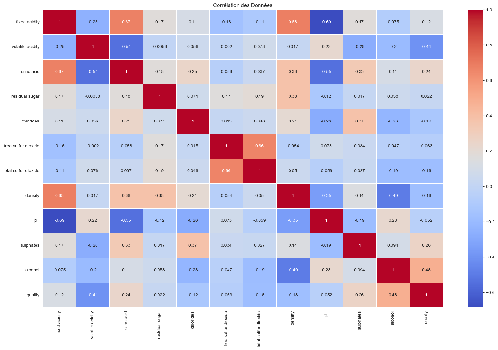

# Étude de Prédiction de la Qualité du Vin

Ce projet utilise des techniques de machine learning pour prédire la qualité des vins.
Le dataset utilisé provient d'une base de données Kaggle. 
https://www.kaggle.com/datasets/yasserh/wine-quality-dataset?select=WineQT.csv

## 1. Première Étude : Utilisation des variables "density" et "alcohol"

Dans un premier temps, nous avons utilisé les variables **density** et **alcohol** pour essayer de prédire la qualité du vin. Voici la représentation de cette première étude :

## 2. Matrice de Corrélation

Pour améliorer les performances du modèle, une matrice de corrélation a été calculée afin de sélectionner les variables les plus influentes sur la qualité du vin. Les variables retenues sont :

- **alcohol**
- **sulphates**
- **citric acid**

Ces trois variables ont montré une forte corrélation avec la qualité du vin.

## 3. Arbre de Décision avec les Nouvelles Variables

En se basant sur l'analyse de corrélation, un nouvel arbre de décision a été construit avec une **profondeur de 6** en utilisant les variables sélectionnées. Voici l'arbre de décision final :

## 4. Réseau de Neurones

En complément de l'arbre de décision, un réseau de neurones a été implémenté pour tester la prédiction de la qualité sur plusieurs échantillons de vins. Les résultats obtenus avec le réseau de neurones étaient en accord avec ceux de l'arbre de décision, confirmant la pertinence des variables sélectionnées.

## Conclusion

Cette étude montre que l'utilisation des variables **alcohol**, **sulphates** et **citric acid** permet de bien prédire la qualité des vins. L'arbre de décision et le réseau de neurones ont tous les deux permis d'obtenir des résultats satisfaisants.

