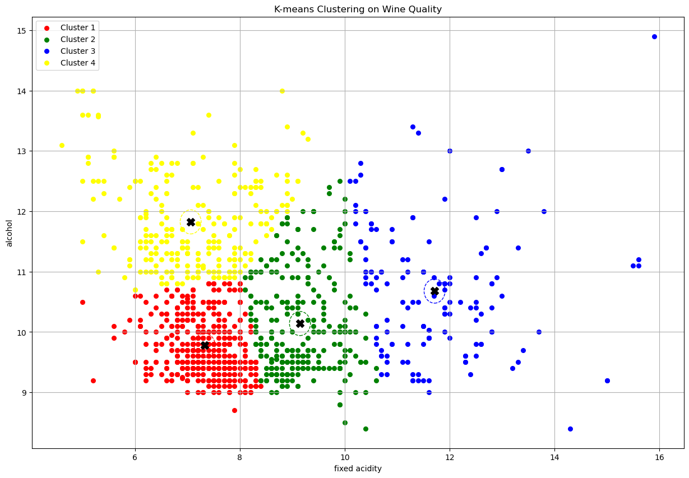

# Étude de Prédiction de la Qualité du Vin

Ce projet utilise des techniques de machine learning pour prédire la qualité des vins.
Le dataset utilisé provient d'une base de données Kaggle. 
https://www.kaggle.com/datasets/yasserh/wine-quality-dataset?select=WineQT.csv

## PARTIE 1

## 1. Première Étude : Utilisation des variables "density" et "alcohol"

Dans un premier temps, nous avons utilisé les variables **density** et **alcohol** pour essayer de prédire la qualité du vin. Voici la représentation de cette première étude :

## 2. Matrice de Corrélation

Pour améliorer les performances du modèle, une matrice de corrélation a été calculée afin de sélectionner les variables les plus influentes sur la qualité du vin. Les variables retenues sont :

- **alcohol**
- **sulphates**
- **citric acid**

Ces trois variables ont montré une forte corrélation avec la qualité du vin.

## 3. Arbre de Décision avec les Nouvelles Variables

En se basant sur l'analyse de corrélation, un nouvel arbre de décision a été construit avec une **profondeur de 6** en utilisant les variables sélectionnées. Voici l'arbre de décision final :

## 4. Réseau de Neurones

# Analyse de la qualité du vin - Approche par neurones et MLP

Ce projet fait partie d'un TP visant à analyser les données d'un dataset choisi par nos soins. Dans ce cas, nous avons utilisé un dataset sur la **qualité des vins**. L'objectif est d'appliquer les techniques apprises en cours pour déterminer si un vin est de "bonne qualité" ou de "mauvaise qualité" en fonction de ses caractéristiques chimiques.

## Ce qui a été produit
1. Comprendre et mettre en œuvre un modèle de **neurone simple** pour classifier les vins.
2. Identifier les limites d'un neurone simple dans ce contexte.
3. Élaborer et entraîner un **MLP (Multi-Layer Perceptron)** pour une classification plus précise.
4. Comparer les performances des deux méthodes (neurone simple et MLP).

## Structure du projet

### 1. **Dataset**
Les étiquettes de qualité sont binarisées :
- **1** : Bonne qualité (score >= 6).
- **0** : Mauvaise qualité (score < 6).

### 2. **Approches implémentées**

#### **2.1 Neurone simple**
Un perceptron (neurone simple) a été implémenté pour effectuer une classification binaire. Il prend en entrée les caractéristiques chimiques des vins et applique une fonction de somme pondérée suivie d'une règle de décision simple.

- **Limites constatées** :
  - Un neurone simple ne peut tracer qu'une frontière linéaire pour séparer les classes.
  - Les données étant non linéairement séparables, la précision obtenue était limitée.

#### **2.2 Multi-Layer Perceptron (MLP)**
Pour surmonter les limites du perceptron, un MLP a été implémenté. Le MLP comporte plusieurs couches cachées avec des fonctions d'activation non linéaires, permettant d'apprendre des relations plus complexes entre les données.

- **Configuration** :
  - Deux couches cachées initiales : (8, 5) neurones.
  - Ajout progressif de couches et d'optimisations (32, 16, 8) pour améliorer les performances.

- **Avantages** :
  - Une capacité accrue à capturer les motifs complexes dans les données.
  - Une précision significativement améliorée par rapport au neurone simple.

### 3. **Comparaison des résultats**
Les deux modèles ont été comparés sur leur capacité à classifier correctement les vins en "bonne" ou "mauvaise" qualité.

| Modèle           | Précision |
|-------------------|-----------|
| Neurone simple   | ~70%      |
| MLP optimisé     | ~79%      |

Malgré l'amélioration avec le MLP, la précision pourrait être augmentée davantage avec des données supplémentaires ou un ajustement des hyperparamètres.

### 4. **Exemples de test**
Des exemples de vins spécifiques (comme **Chablis**, **La Turque**, et **Monbazillac**) ont été testés pour vérifier si le modèle pouvait identifier correctement leur qualité. Les caractéristiques chimiques utilisées pour ces exemples sont :

- **Chablis** : `[7.0, 0.3, 0.4, 1.2, 0.045, 15.0, 75.0, 0.992, 3.35, 0.7, 12.5]`
- **La Turque** : `[6.5, 0.4, 0.35, 1.8, 0.05, 18.0, 85.0, 0.994, 3.65, 0.75, 13.5]`
- **Monbazillac** : `[5.5, 0.3, 0.4, 120.0, 0.05, 35.0, 150.0, 1.020, 3.6, 0.6, 13.0]`

Ces exemples ont été soumis au modèle MLP pour prédire leur qualité. De plus, les mêmes exemples ont été testés avec un modèle de **decision tree** pour vérifier la cohérence des résultats. Les prédictions obtenues avec les deux modèles étaient concordantes, confirmant ainsi la véracité des données utilisées.

Cette validation croisée a renforcé la confiance dans les résultats et a démontré que les modèles étaient capables d'identifier correctement des vins spécifiques en fonction de leurs caractéristiques chimiques.

## Conclusion

Ce projet met en lumière les forces et les faiblesses des modèles de neurones simples et des MLP dans la classification, tout en montrant l'importance de la validation croisée avec d'autres modèles.

- Le **neurone simple** offre une solution rapide et intuitive, mais reste limité par sa capacité à tracer uniquement des frontières de décision linéaires. Cela le rend moins efficace pour des données complexes et non linéaires, comme celles utilisées dans ce projet.

- En revanche, le **MLP (Multi-Layer Perceptron)** permet d'exploiter des relations non linéaires entre les caractéristiques, grâce à ses couches cachées et ses fonctions d'activation. Cela en fait un outil beaucoup plus puissant et adapté pour ce type de tâche.

De plus, les prédictions obtenues ont été vérifiées à l'aide d'un **decision tree** sur des exemples spécifiques (Chablis, La Turque, Monbazillac). Cette validation croisée a confirmé la cohérence des résultats et la fiabilité des données utilisées.

## Conclusion

Cette étude montre que l'utilisation des variables **alcohol**, **sulphates** et **citric acid** permet de bien prédire la qualité des vins. L'arbre de décision et le réseau de neurones ont tous les deux permis d'obtenir des résultats satisfaisants.

## PARTIE 2

## Algorithme KMEANS
Rappel sur le kmeans : algorithme d'apprentissage non supervisé utilisé pour regrouper (ou "cluster") des données en K groupes distincts
L'objectif est de regrouper des données similaires dans un même cluster pour identifier les différentes tendances et analyser les données

# Premier cas d'étude : choix des critères 'fixed acidity' et 'alcohol'

# 4 clusters

Intérêt des critères fixed acidity et alchool :
permet un regroupement des vins sur base des propriétés physico-chimiques qui influencent le style : léger, corsé, acide, doux etc 

Principe : les vins sont regroupés en 4 clusters selon leur acidité fixe et leur taux d'alcool
Chaque cluster regroupe des vins aux caractéristiques similaires
Le graphique permet de visualiser ces groupes et leur position par rapport aux centroïdes

Lecture du K = 4 :

Cluster 1 (rouge) :
Correspond aux vins avec une acidité fixe relativement faible (environ 6 à 8) et un taux d’alcool faible (entre 9 et 11).
Cluster compact, indiquant une certaine homogénéité dans ces caractéristiques.

Cluster 2 (jaune) :
Concerne des vins ayant une acidité légèrement supérieure (environ 7 à 10) et un taux d’alcool moyen (environ 10 à 13).
Les points sont légèrement plus dispersés, ce qui peut indiquer une plus grande variété parmi les vins de ce groupe.

Cluster 3 (vert) :
Ces vins ont une acidité fixe modérée (environ 8 à 11) et un taux d’alcool similaire au Cluster 2 (10 à 13).
Le chevauchement avec Cluster 2 montre qu’il peut être difficile de distinguer ces deux groupes.

Cluster 4 (bleu) :
Situé à l’extrême droite, sur la zone des acidités les plus élevées (12 à 16) et un taux d’alcool modéré (10 à 15).
Cluster très dispersé, ce qui indique une grande diversité parmi ces vins.

Chevauchement Cluster 2 (jaune) et Cluster 3 (vert) :
La frontière entre ces deux groupes n'est pas clairement définie. Cela peut indiquer que les caractéristiques "fixed acidity" et "alcohol" ne suffisent pas toujours à bien séparer ces vins.

Dispersions dans le Cluster 4 (bleu) :
Les points sont très éloignés du centroïde, ce qui montre une diversité élevée dans ce groupe. Cela pourrait être dû à des sous-groupes non détectés ou à des variations importantes dans les caractéristiques choisies.
 
Les vins avec une faible acidité et un faible taux d'alcool (Cluster 1) forment un groupe distinct et homogène.
Les vins ayant une acidité élevée (Cluster 4) sont plus variés, ce qui peut indiquer une plus grande diversité dans leurs caractéristiques chimiques ou de production.
Les clusters 2 et 3 montrent qu'il y a une transition progressive entre des acidités et taux d'alcool modérés, rendant leur séparation moins nette.

# 2 clusters

# 8 clusters

# 3D clusters

# KNN 

Comprendre le KNN :
Contrairement au K-Means qui est non supervisé, KNN est un algorithme supervisé.
Il est utilisé pour classifier des points (ou prédire une valeur numérique, si c'est un problème de régression) en se basant sur les classes ou valeurs de ses voisins les plus proches.

Analyse rapide du graphique :
Le modèle KNN a une précision modérée (0.59), ce qui montre qu’il n’est pas encore optimal pour capturer toute la complexité des données. Cela peut être dû à une séparation non linéaire ou à un manque de données équilibrées entre les classes.
Cependant, certaines classes restent mal représentées ou mal prédites, ce qui peut indiquer la nécessité d’ajuster davantage les hyperparamètres (comme le choix de 
k) ou de tester voir compléter avec d'autres algorithmes comme les arbres de décision vu plus haut.

## CONCLUSION DU PROJET
Ce projet met en évidence les forces et les limites des différents modèles de classification, tout en illustrant l'importance de sélectionner les bonnes variables et de valider les prédictions à l'aide de méthodes complémentaires.

L'utilisation des variables alcohol, sulphates et citric acid s'est révélée pertinente pour prédire la qualité des vins. Ces caractéristiques offrent une bonne séparation des classes, bien que des défis persistent pour certaines qualités proches.

Le neurone simple offre une solution rapide et intuitive, mais sa capacité limitée à tracer uniquement des frontières de décision linéaires le rend inadapté à des données complexes et non linéaires, comme celles du vin.

En revanche, le MLP (Multi-Layer Perceptron), grâce à ses couches cachées et ses fonctions d'activation, exploite les relations non linéaires entre les caractéristiques. Cela en fait un outil puissant et plus adapté pour prédire des classes de qualité avec des relations complexes.

L'étude a également validé les prédictions à l'aide d'un decision tree appliqué sur des exemples spécifiques (Chablis, La Turque, Monbazillac), confirmant la cohérence des résultats et la fiabilité des données utilisées.

En conclusion, l'approche combinée des modèles, en particulier avec des techniques comme le MLP et les arbres de décision, permet d'obtenir des résultats satisfaisants pour prédire la qualité des vins, tout en soulignant l'importance des variables sélectionnées pour la tâche.
